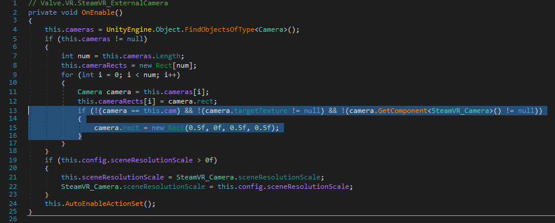
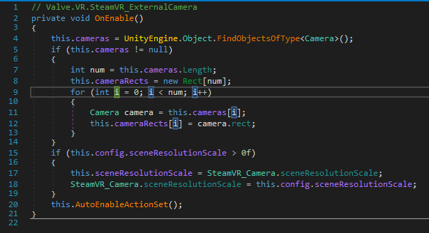
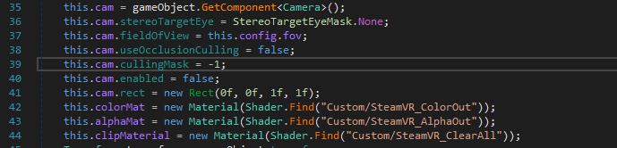
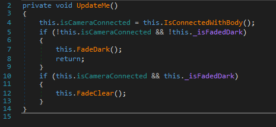
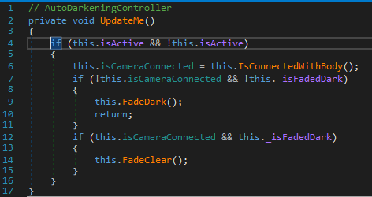

# Patching Instructions

## Overview
Cooking Simualtor VR supports quadrant view Mixed Reality compositing natively, and the presence of an `ExternalCamera.cfg` file and a third tracked object (controller or tracker, either physical or virtual) will display the quadrant view.

Without patching however the in-headset view is severely distorted, and even if you were able to play, you would find that tools such as the blowtorch or stick blender would not operate. Finally in the Mixed Reality Quadrant View UI layers and fire is not visible by default. This patch aims to fix all of the above.

## Method

Remember that this is a destructive process, so please **BACK UP YOUR ORIGINAL FILE(S) BEFORE DOING THIS**.

There are two DLLs to import in to dnSpy. Firstly import the following DLL to dnSpy: `Cooking Simulator VR\CookingSimulatorVR_Data\Managed\SteamVR.dll`

### Headset Distortion

To correct the distorted in-headset camera view navigate to `SteamVR\SteamVR.dll\Valve.VR\SteamVR_ExternalCamera`.

Here we first look at the method `OnEnable()`

Remove the highlighted lines of code so that your method looks like this:

### Object Visibility

Whilst we are in `SteamVR_ExternalCamera`, in the method `AttachToCamera()` add the highligted line below:

This will show all in-game objects to the external camera. It does come with the disadvantage that you get to see a black box over the player's head during scene loading (i.e. the blackout), but this is the quick, dirty but functional option, barring looking in to all of the in-game layers.

You can compile this and move on to the next file

### Interaction Fixes

Second file to import into dnSpy is: `Cooking Simulator VR\CookingSimulatorVR_Data\Managed\Assembly-CSharp.dll`

Navigate to `Assembly-CSharp\Assembly-CSharp.dll\{} - \AutoDarkeningController\` and open the method `UpdateMe()`. 

The initial state of the method should be this:

It's possible to just simply remove all of the code here, but I wanted to at least keep as much of the original code in the DLL. Comments cannot be compiled, and simply get stripped out so I've surrounded the code in a if statement that can never evaluate to true. If you don't care about this, simply strip the code out, but for full transparency, this how the packaged DLLs have been updated.

The resulting code will look like this:

Make sure you save this module once you're done too.

You now need to launch Cooking Simulator VR with an ExternalCamera.cfg file in the game folder, and a third controller or a tracker attached. As mentioned above, the LIV virtual tracker works nicely.

LIV has recently stopped supporting legacy compositing so you will need to composite this manually.