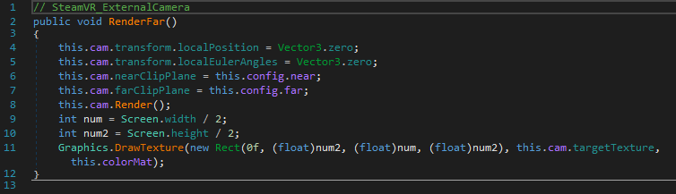
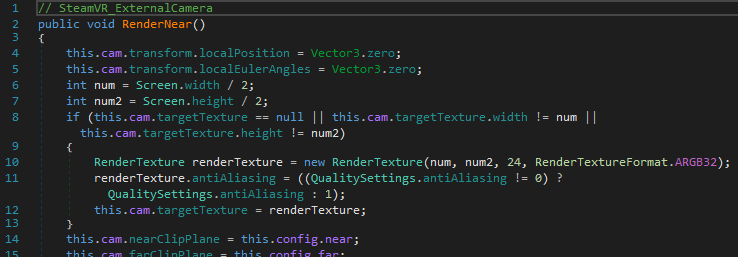

# Patching Instructions

## Overview
Cricket Club supports quadrant view Mixed Reality compositing natively, and the presence of an `ExternalCamera.cfg` file and a third tracked object (controller or tracker, either physical or virtual) will display the quadrant view.

The third tracked object never lined up to the virtual camera however, and the rotation was very off, seeming to double the rotational values from the input.

## Method

Remember that this is a destructive process, so please **BACK UP YOUR ORIGINAL FILE(S) BEFORE DOING THIS**.

Import in to dnSpy the following DLL:  `Cricket Club\CC2020.3_Data\Managed\Assembly-CSharp.dll`

To correct the wonky camera angles on the game when using a third tracked object (e.g. LIV virtual tracker) navigate to:
 `Assembly-CSharp\Assembly-CSharp.dll\{} - \SteamVR_ExternalCamera\` 

In here there are two functions, RenderFar and RenderNear. We need to need to add two lines of code to the top of each of those functions as follows:
`    this.cam.transform.localPosition = Vector3.zero;`
`    this.cam.transform.localEulerAngles = Vector3.zero;`

When you're done the two methods should look like this.

Make sure you save the module once you're done too.

You now need to launch Cricket Club with an ExternalCamera.cfg file in the game folder, and a third controller or a tracker attached. As mentioned above, the LIV virtual tracker works nicely.

LIV has recently stopped supporting legacy compositing so you will need to composite this manually.