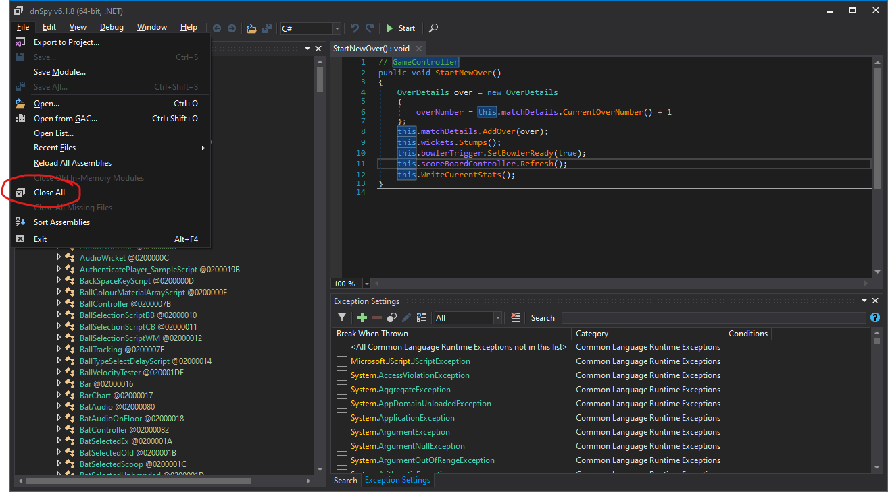
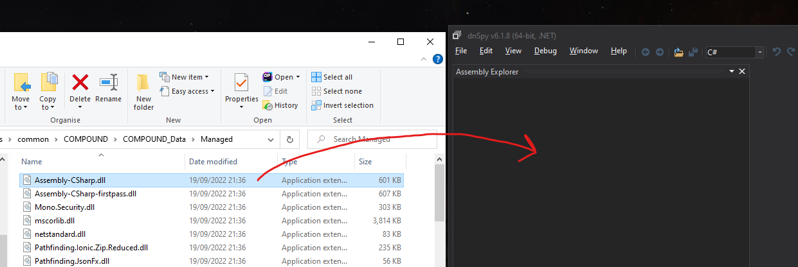
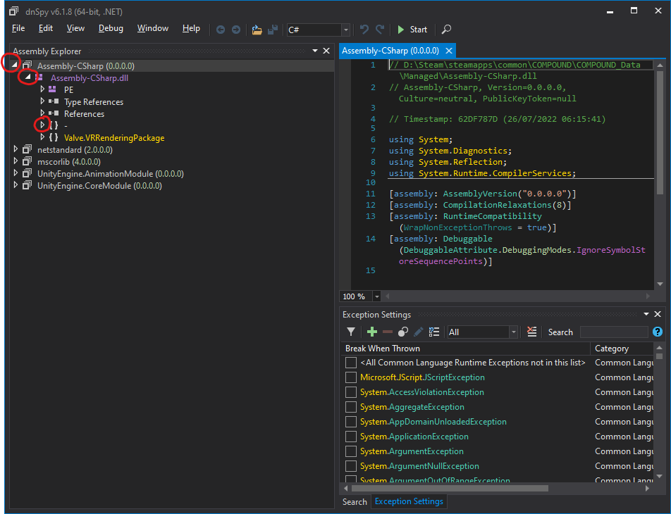
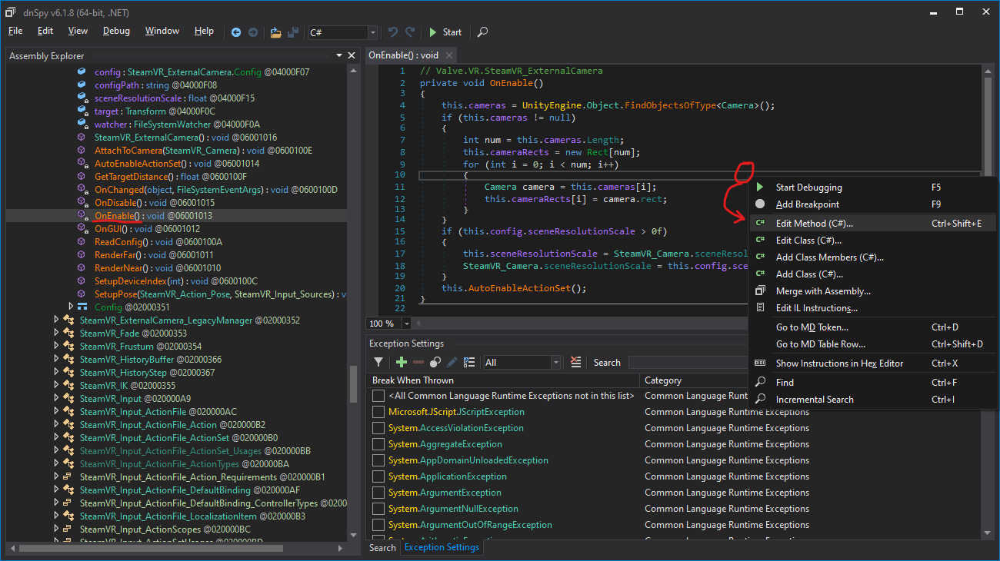
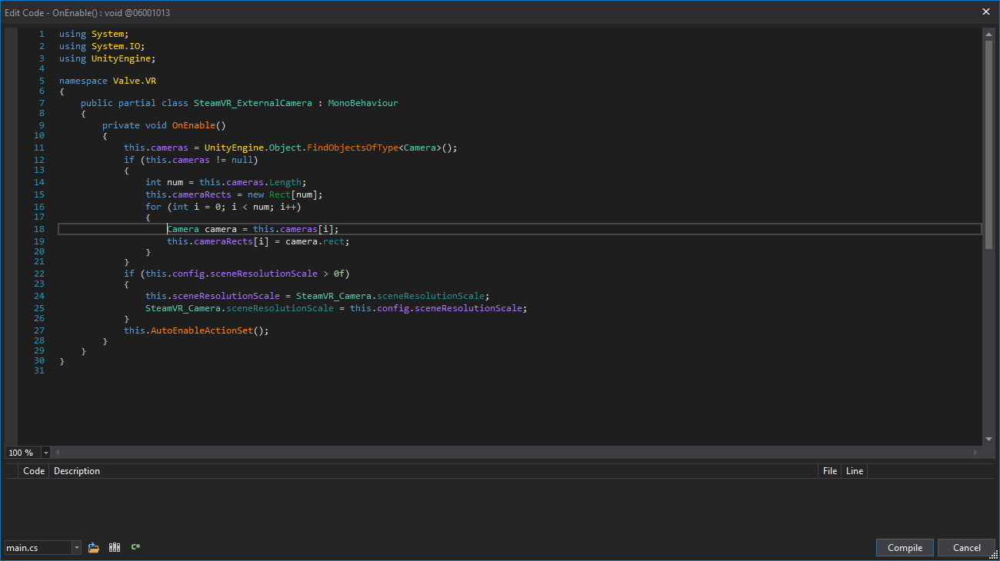
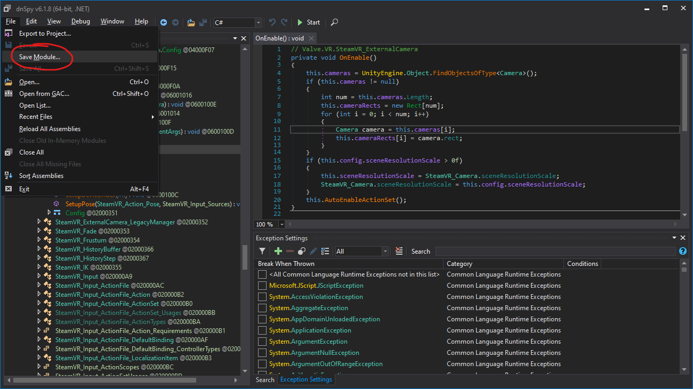
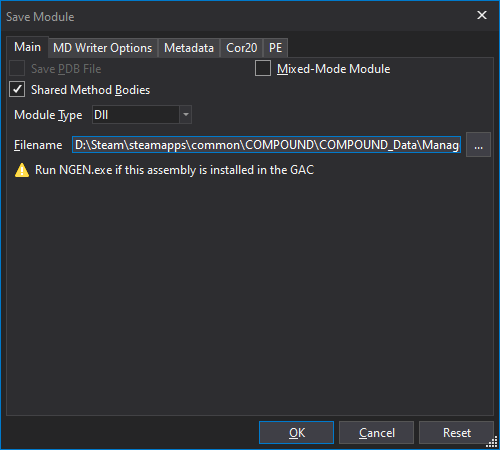

# Unity-Mixed-Reality-Patches

You should probably never download random DLLs from random internet dudes so I recommend
best practice is to not download the recompiled DLLs but to recreate the mod yourself. 

I do understand however that this is too much for some in terms of how long it takes or if you're just not confortable doing it. If you're happy to accept the risk of random dude on the internet giving you sweeties in a van crudely spray painted with "Free Puppies", then I've included the DLLs directly.

Despite all the above hyperbole, it is possible to verify the compiled DLLs using a .NET decompiler (in the same way that the mods are created), so create an issue and call it out if you've attempted to verify a patch and it's not as described.

## Method
*Your warranty is now void. I am not responsible for bricked devices, dead SD cards, thermonuclear war, or you getting fired because the alarm app failed.*

While it's not quite as risky perhaps as flashing a ROM on a phone, patching DLLs is a destructive process, so please make sure you **back up your original file(s)** before you modify them. 

Verifying the integrity of your game files through steam will spot this change and overwrite, so you may also want to take a copy of your modified file(s).

Any update to a game is likely to overwrite these files so you will have to reapply the same patch process when new versions are released. (Doing this is likely to be quicker than waiting for me to provide the updated DLL)

Finally, I've not tested this with any anti-cheat software, so things like EAC are likely to be triggered by such a mod.

## Tools
The tool you'll need for this kind of DLL editing is dnSpy. I'm sure that there are other C# IL decompilers / recompilers out there but this is the one I've been using to some degree of success. 

https://github.com/dnSpy/dnSpy

This version of dnSpy is now archived, but I've been using it fine with the games I've been modding so far. I should probably update to https://github.com/dnSpyEx/dnSpy which seems to be the successor of this.

## Process
So here's a quick tutorial on how to use dnSpy to patch a DLL:

### Setting up your workspace
dnSpy opens any dependencies it comes across so you will likely want to start by closing all the previously opened assemblies from any previous session.

### Opening an Assembly
Simply drag and drop the assembly you want to open in to the left hand pane of dnSpy (the Assembly Explorer pane).

### Find the code you want to patch
Expand the tree nodes from your loaded assembly to get to the class or method you want to patch.

Note the final one highlighted there is the Root Namespace: `{} -`. I've found that is often where much of the codebase lives, so if you see `{} -` in the path for the patching instructions, this is what it is referencing.

### Modify the code
Once you've found the code you want to change (most often within a method) you can right click in to the code section and (if you're editing a method) click Edit Method.

This pops open a new window where you can edit this code. Once you are done, click Compile at the bottom to check the the code compiles and save it to memory. 

### Save the Changes
To commit your changes back to the DLL you need go to File and Save Module

This pops open a new window where you can confirm the path and other options. If you do not change the path you will overwrite your existing DLL file. Please make sure you take backups of the original. Clicking OK saves the DLL.
